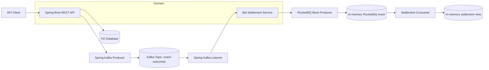

# sporty-group-assignment

Spring Boot solution for the Kafka / RocketMQ backend assignment.

## Architecture



## Processing Flow

1. `POST /api/event-outcomes` receives an `EventOutcomeRequest`.
2. The request is validated and mapped to the domain `EventOutcome`.
3. Spring Kafka publishes the payload to the `event-outcomes` topic.
4. The Kafka listener consumes the message and hands it to settlement processing.
5. The settlement service looks up matching bets in H2.
6. For each matching bet, a settlement message is produced.
7. The RocketMQ side is mocked in-process and records/consumes settlement messages.
8. Duplicate settlement messages are ignored by the settlement consumer using an idempotency key.

## Design Decisions

- Spring Boot is used for the HTTP layer, validation, and dependency wiring.
- Kafka is handled with Spring Kafka instead of a custom broker implementation.
- Bet persistence uses H2 through Spring Data JPA so the store behaves like a real repository.
- `EventOutcomeRequest` is kept separate from the domain `EventOutcome` so the API contract does not leak internal model concerns.
- Settlement logic is isolated in `BetSettlementService` so it is testable without HTTP or broker concerns.
- Idempotency is enforced at the settlement consumer boundary using a stable `eventId:betId` key.

## Why Brokers Were Mocked

- The assignment explicitly allows mocking the RocketMQ side if setup is too complex.
- RocketMQ is not required to prove the core event-to-settlement workflow, so mocking it keeps the system smaller and easier to run.
- The mock lets the settlement path stay observable in tests and local execution without needing another external service.
- Kafka is still exercised through Spring Kafka because that part of the assignment is central to the flow and has an embedded Kafka test setup.

## Assumptions

- `betId` is unique.
- A bet belongs to one `eventId` and one winner outcome is enough to settle it.
- A settlement is determined by comparing `bet.eventWinnerId` with `eventOutcome.eventWinnerId`.
- The event outcome payload always contains `eventId`, `eventName`, and `eventWinnerId`.
- Settlement messages are processed at least once, so idempotency is required in the consumer.
- H2 is acceptable for the assignment scope and does not need to survive restarts.

## Future Improvements

- Persist idempotency keys in H2 so duplicate protection survives application restarts.
- Replace the RocketMQ mock with a real RocketMQ producer and consumer path.
- Add database migrations instead of relying on JPA auto schema updates.
- Add dead-letter handling and retry policy for Kafka processing failures.
- Add outbox-style persistence if settlement publishing must become transactional.
- Expand observability with structured log correlation, metrics, and tracing.

## What it does

- Exposes `POST /api/event-outcomes` to publish an event outcome.
- Consumes the outcome from Spring Kafka on topic `event-outcomes`.
- Matches bets in an H2-backed repository by `eventId`.
- Produces settlement messages to a mocked RocketMQ broker on topic `bet-settlements`.
- Consumes settlement messages from the same settlement topic.
- Includes `POST /api/bets`, `GET /api/bets`, `GET /api/settlements`, and `GET /api/health` for local verification.

## Run Locally

You need Maven, Java, and a Kafka broker on `localhost:9092`.

```powershell
mvn spring-boot:run
```

The service listens on `http://localhost:8080`.

Run tests with:

```powershell
mvn test
```

## Example Requests

Create a bet:

```bash
curl -X POST http://localhost:8080/api/bets \
  -H "Content-Type: application/json" \
  -d "{\"betId\":1,\"userId\":10,\"eventId\":100,\"eventMarketId\":5,\"eventWinnerId\":2,\"betAmount\":25.0}"
```

Publish an outcome:

```bash
curl -X POST http://localhost:8080/api/event-outcomes \
  -H "Content-Type: application/json" \
  -d "{\"eventId\":100,\"eventName\":\"Match 100\",\"eventWinnerId\":2}"
```

Read settlements:

```bash
curl http://localhost:8080/api/settlements
```

## Docker

Build and run the app stack:

```bash
docker compose up --build
```

Kafka is provided as a real broker in `docker-compose.yml`. RocketMQ remains mocked in-process.
